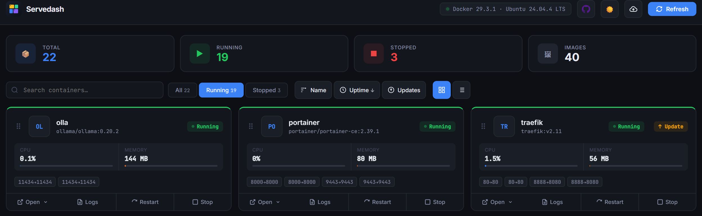
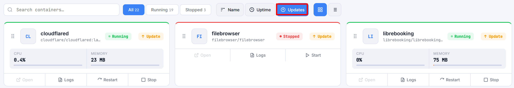

# Servedash 🚀

[](https://github.com/DestinyJazz/servedash/releases)
[](https://github.com/DestinyJazz/servedash/pkgs/container/servedash)
[](https://github.com/DestinyJazz/servedash/blob/main/LICENSE)

A simple Docker dashboard I built because Portainer felt too heavy for just wanting to see what's running.

Auto-discovers all your containers, shows CPU/RAM, lets you tail logs, and opens each service — without leaving the page.



## Features

- Scans all Docker containers automatically (running and stopped)
- CPU & RAM usage per container
- Live log viewer with search and filter

- Start / Stop / Restart from the dashboard
- Click to open any service — picks the right port if there are multiple

- Drag cards to reorder, or sort by name, uptime, or available updates
- Image update detection — flags containers when a newer image is available (Docker Hub, GHCR, lscr.io)

- Grid and list view
- Dark / light mode

## Getting Started

```bash
git clone https://github.com/DestinyJazz/servedash.git
cd servedash
docker compose up -d
```

Then open `http://your-server-ip:3000`

That's it. No config file needed.

## Portainer

1. Stacks → Add stack
2. Paste `docker-compose.yml`
3. Deploy

## Custom URL for a container

If auto-detection picks the wrong port, add a label:

```yaml
labels:
  - "servedash.url=https://myapp.example.com"
```

Servedash also reads `homepage.href` if you already use it, so existing Homepage labels work without changes. The older `dashboard.url` label is still supported too.

## Image updates

Servedash can check whether a newer image is available for your containers. When one is, the card shows an "Update" badge.

- Click the cloud icon in the header to check on demand
- Or set `UPDATE_CHECK_INTERVAL` to check automatically

This is read-only. It tells you an update exists but never touches your containers. Only public images on Docker Hub, GHCR, and lscr.io are checked. Private and other registries show as unsupported.

## Configuration

All optional, set via environment variables in `docker-compose.yml`:

| Variable | Default | Description |
|---|---|---|
| `PORT` | `3000` | Port Servedash listens on |
| `REFRESH_INTERVAL` | `0` | Auto-refresh container status, in seconds. 0 = off |
| `UPDATE_CHECK_INTERVAL` | `0` | Auto-check for image updates, in minutes. 0 = manual only |

To keep your drag order across restarts, mount a volume at `/app-data`:

```yaml
volumes:
  - servedash-data:/app-data
```

## Change the port

```bash
PORT=8080 docker compose up -d
```

## Local development

```bash
docker compose -f docker-compose.dev.yml up -d --build
```

## Security

Servedash mounts the Docker socket read-only. Don't expose it to the public internet — keep it on your local network or put it behind a reverse proxy with auth.

---

# Servedash 🚀

[](https://github.com/DestinyJazz/servedash/releases)
[](https://github.com/DestinyJazz/servedash/pkgs/container/servedash)
[](https://github.com/DestinyJazz/servedash/blob/main/LICENSE)

自己搭的 Docker dashboard，因为觉得 Portainer 对于「只是想看看哪些服务在跑」来说太重了。

自动扫描所有 container，显示 CPU/RAM，可以查 logs，一键打开各个服务 — 不需要切换页面。


## 功能

- 自动扫描所有 Docker container（包括已停止的）
- 每个 container 的 CPU 和内存使用率
- 实时 log 查看器，支持搜索和过滤

- 直接从 dashboard 启动 / 停止 / 重启
- 点击直接打开服务，有多个 port 时会显示选择菜单

- 拖拽卡片排序，或按名称、运行时间、有无更新排序
- 镜像更新检测 — 有新版镜像时在卡片上标记（Docker Hub、GHCR、lscr.io）

- 支持 Grid 和 List 两种视图
- 深色 / 浅色主题切换

## 开始使用

```bash
git clone https://github.com/DestinyJazz/servedash.git
cd servedash
docker compose up -d
```

打开 `http://你的服务器IP:3000`

不需要任何配置文件。

## Portainer 部署

1. Stacks → Add stack
2. 粘贴 `docker-compose.yml` 内容
3. Deploy

## 自定义服务 URL

如果自动检测的 port 不对，加一个 label：

```yaml
labels:
  - "servedash.url=https://myapp.example.com"
```

如果你已经在用 `homepage.href`，Servedash 也会读取，现有的 Homepage label 不用改动就能用。旧的 `dashboard.url` label 同样仍然支持。

## 镜像更新

Servedash 可以检查容器是否有新版镜像。有的话，卡片上会显示「Update」标记。

- 点击 header 的云图标手动检查
- 或设置 `UPDATE_CHECK_INTERVAL` 自动检查

这是只读的，只告诉你有更新，不会改动你的容器。只检查 Docker Hub、GHCR、lscr.io 上的公开镜像。私有和其他 registry 显示为不支持。

## 配置项

均为可选，通过 `docker-compose.yml` 里的环境变量设置：

| 变量 | 默认值 | 说明 |
|---|---|---|
| `PORT` | `3000` | Servedash 监听的端口 |
| `REFRESH_INTERVAL` | `0` | 容器状态自动刷新，单位秒。0 = 关闭 |
| `UPDATE_CHECK_INTERVAL` | `0` | 自动检查镜像更新，单位分钟。0 = 只手动 |

要让拖拽顺序在重启后保留，挂载一个卷到 `/app-data`：

```yaml
volumes:
  - servedash-data:/app-data
```

## 修改端口

```bash
PORT=8080 docker compose up -d
```

## 本地开发

```bash
docker compose -f docker-compose.dev.yml up -d --build
```

## 安全说明

Servedash 以只读方式挂载 Docker socket。不要暴露在公网上，建议放在内网或者用带认证的反向代理保护。

## License

MIT
