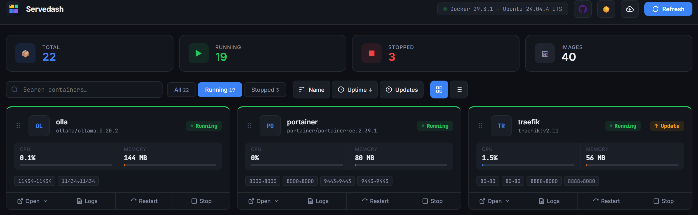
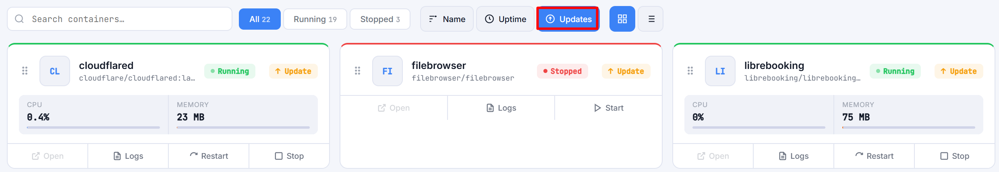

# Servedash 🚀

[](https://github.com/DestinyJazz/servedash/releases)
[](https://github.com/DestinyJazz/servedash/pkgs/container/servedash)
[](https://github.com/DestinyJazz/servedash/blob/main/LICENSE)

<a href="https://www.buymeacoffee.com/djlch" target="_blank"></a>

I built this because Portainer felt like too much when all I wanted was to see what's running. It's a small dashboard for checking on your containers, without a full management suite.

It finds all your containers, shows CPU and RAM usage, lets you read the logs, and opens each service, all from one page.



## Features

- Scans all Docker containers automatically (running and stopped)
- CPU & RAM usage per container, with color-coded bars (green / yellow / red by load)
- Live log viewer with search and filter

- Start / Stop / Restart / Pause / Unpause from a per-container Actions menu
- Click to open any service. If it has more than one port, you pick one from a menu

- Status filter (Running, Stopped, Paused, Unhealthy) with live counts
- Detects unhealthy containers (running but failing their healthcheck)
- Drag cards to reorder, or sort by name, uptime, or available updates
- Image update detection: flags containers when a newer image is available (Docker Hub, GHCR, lscr.io) and can pull and recreate them in one click (see [Image updates](#image-updates))

- Built-in web terminal to open a shell inside any running container, no SSH needed

- Grid and list view
- Dark / light mode

## Getting Started

```bash
git clone https://github.com/DestinyJazz/servedash.git
cd servedash
docker compose up -d
```

Then open `http://your-server-ip:3000`

That's it. No config file needed.

Images are available for `linux/amd64` and `linux/arm64` (Raspberry Pi 4/5, ARM servers). Docker pulls the right one for your machine.

## Portainer

1. Stacks → Add stack
2. Paste `docker-compose.yml`
3. Deploy

## Custom URL for a container

If auto-detection picks the wrong port, add a label:

```yaml
labels:
  - "servedash.url=https://myapp.example.com"
```

Servedash also reads `homepage.href` if you already use it, so existing Homepage labels work without changes. The older `dashboard.url` label is still supported too.

## Image updates

Servedash can check whether a newer image is available for your containers. When one is, the card shows an "Update" badge.

- Click the cloud icon in the header to check on demand
- Or set `UPDATE_CHECK_INTERVAL` to check automatically
- Only public images on Docker Hub, GHCR, and lscr.io are checked. Private and other registries show as unsupported.

Clicking the "Update" badge pulls the new image and recreates the container with its current configuration (ports, volumes, env, networks). Before it changes anything, Servedash checks how risky the update is:

- **Safe** (not managed by docker-compose or a Portainer stack, no custom network setup, no legacy container linking). One click, no extra confirmation.

- **Risky** (compose-managed, Portainer-managed, or has custom networking): Servedash tells you why, and you have to tick "I understand the risk, update anyway" first. If compose or Portainer manages the container, recreating it here means it no longer matches your compose file or stack, so the next `docker compose up -d` or Portainer redeploy might not do what you expect.


If something fails halfway through, Servedash puts the original container back.

Two cases don't get a one-click update:

- **Pinned versions** (e.g. `myapp:1.2.1`): Servedash looks for a higher version in the registry and shows it on the badge (`↑ 1.3.0`). It won't change a pinned version for you, because a newer version can have breaking changes. Click the badge to see which tag to switch to.
- **Servedash itself**: an update has to stop the old container, and Servedash runs inside that container, so it would shut itself down halfway. When a new version is out, the version next to the logo turns orange. Click the badge on Servedash's card to get the command to run on the host (e.g. `docker compose pull && docker compose up -d`).

## Configuration

All optional, set via environment variables in `docker-compose.yml`:

| Variable | Default | Description |
|---|---|---|
| `PORT` | `3000` | Port Servedash listens on |
| `REFRESH_INTERVAL` | `0` | Auto-refresh container status, in seconds. 0 = off |
| `UPDATE_CHECK_INTERVAL` | `0` | Auto-check for image updates, in minutes. 0 = manual only |

To keep your drag order across restarts, mount a volume at `/app-data`:

```yaml
volumes:
  - servedash-data:/app-data
```

## Change the port

```bash
PORT=8080 docker compose up -d
```

## Local development

```bash
docker compose -f docker-compose.dev.yml up -d --build
```

## Security

Servedash mounts the Docker socket read-write. The built-in terminal (`docker exec`) and one-click image updates (pull/stop/create/remove) need it, and that access is the same as root on the host. Don't expose Servedash to the internet. Keep it on your local network, or put it behind a reverse proxy with authentication.

---

# Servedash 🚀

[](https://github.com/DestinyJazz/servedash/releases)
[](https://github.com/DestinyJazz/servedash/pkgs/container/servedash)
[](https://github.com/DestinyJazz/servedash/blob/main/LICENSE)

<a href="https://www.buymeacoffee.com/djlch" target="_blank"></a>

我只是想看看有哪些服务在跑，用 Portainer 觉得太重，所以自己做了这个。适合只想看状态、用不到完整管理功能的人。

自动扫描所有 container，显示 CPU/RAM，可以看 logs，也能直接打开各个服务，都在同一个页面里。


## 功能

- 自动扫描所有 Docker container（包括已停止的）
- 每个 container 的 CPU 和内存使用率，使用条按负载变色（绿 / 黄 / 红）
- 实时 log 查看器，支持搜索和过滤

- 通过每个容器的 Actions 菜单进行 启动 / 停止 / 重启 / 暂停 / 恢复
- 点击直接打开服务，有多个 port 时会显示选择菜单

- 状态筛选（Running、Stopped、Paused、Unhealthy），带实时计数
- 检测不健康容器（在运行但健康检查失败）
- 拖拽卡片排序，或按名称、运行时间、有无更新排序
- 镜像更新检测：有新版镜像时在卡片上标记（Docker Hub、GHCR、lscr.io），支持一键 pull + 重建（见「镜像更新」）

- 内置网页终端：直接在浏览器里打开任意运行中容器的交互式 shell，不需要 SSH

- 支持 Grid 和 List 两种视图
- 深色 / 浅色主题切换

## 开始使用

```bash
git clone https://github.com/DestinyJazz/servedash.git
cd servedash
docker compose up -d
```

打开 `http://你的服务器IP:3000`

不需要任何配置文件。

镜像同时提供 `linux/amd64` 和 `linux/arm64`（树莓派 4/5、ARM 服务器），Docker 会自动拉取对应架构的版本。

## Portainer 部署

1. Stacks → Add stack
2. 粘贴 `docker-compose.yml` 内容
3. Deploy

## 自定义服务 URL

如果自动检测的 port 不对，加一个 label：

```yaml
labels:
  - "servedash.url=https://myapp.example.com"
```

如果你已经在用 `homepage.href`，Servedash 也会读取，现有的 Homepage label 不用改动就能用。旧的 `dashboard.url` label 同样仍然支持。

## 镜像更新

Servedash 可以检查容器是否有新版镜像。有的话，卡片上会显示「Update」标记。

- 点击 header 的云图标手动检查
- 或设置 `UPDATE_CHECK_INTERVAL` 自动检查
- 只检查 Docker Hub、GHCR、lscr.io 上的公开镜像。私有和其他 registry 显示为不支持。

点击「Update」标记会 pull 新镜像，并用当前容器的配置（端口、volume、环境变量、网络）重建容器。在改动任何东西之前，Servedash 会先做风险分类：

- **安全**（不是 docker-compose 或 Portainer stack 管理的、没有自定义网络配置、没有用旧式容器 link）。一键完成，不需要额外确认。

- **有风险**（compose 管理、Portainer 管理，或有自定义网络配置）：Servedash 会说明原因，你要先勾选「我理解风险，仍然更新」才能继续。如果容器是 compose 或 Portainer 管理的，在这里重建之后，它就跟你的 compose 文件或 stack 对不上了，下次 `docker compose up -d` 或 Portainer redeploy 的结果可能跟你预想的不一样。


如果重建到一半失败了，Servedash 会把原来的容器恢复回来。

有两种情况不能一键更新：

- **固定版本号**（例如 `myapp:1.2.1`）：Servedash 会去 registry 查有没有更高的版本，并显示在标记上（`↑ 1.3.0`），但不会替你改固定的版本号，因为新版本可能有不兼容的改动。点击标记会告诉你该换成哪个 tag。
- **Servedash 自己**：更新需要先停掉旧容器，而 Servedash 就运行在这个容器里，做到一半就会把自己停掉。有新版本时，logo 旁边的版本号会变成橙色，点击 Servedash 卡片上的标记会显示在宿主机上要执行的命令（例如 `docker compose pull && docker compose up -d`）。

## 配置项

均为可选，通过 `docker-compose.yml` 里的环境变量设置：

| 变量 | 默认值 | 说明 |
|---|---|---|
| `PORT` | `3000` | Servedash 监听的端口 |
| `REFRESH_INTERVAL` | `0` | 容器状态自动刷新，单位秒。0 = 关闭 |
| `UPDATE_CHECK_INTERVAL` | `0` | 自动检查镜像更新，单位分钟。0 = 只手动 |

要让拖拽顺序在重启后保留，挂载一个卷到 `/app-data`：

```yaml
volumes:
  - servedash-data:/app-data
```

## 修改端口

```bash
PORT=8080 docker compose up -d
```

## 本地开发

```bash
docker compose -f docker-compose.dev.yml up -d --build
```

## 安全说明

Servedash 以读写方式挂载 Docker socket。内置终端（`docker exec`）和一键镜像更新（pull/stop/create/remove）都需要这个权限，而它等同于宿主机的 root 权限。不要把 Servedash 暴露在公网上，放在内网里，或者放在带认证的反向代理后面。

## License

MIT
